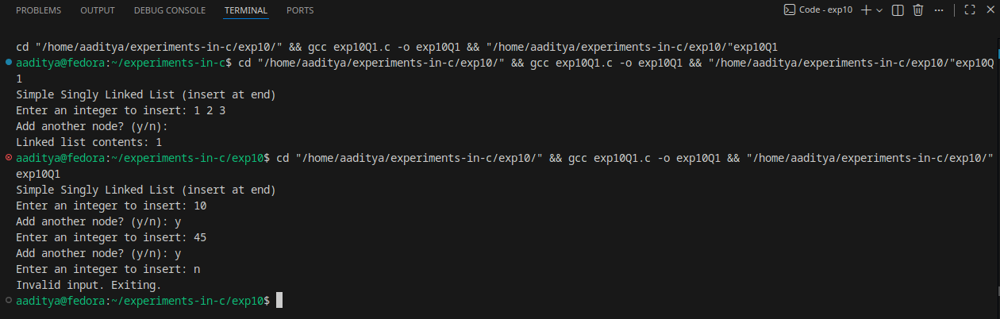
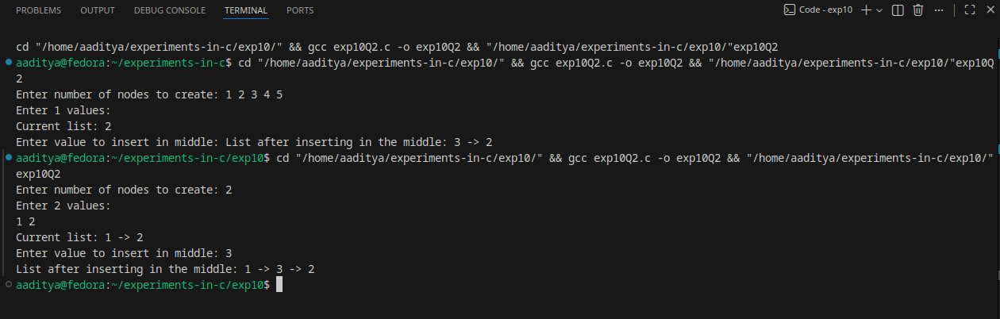

### EXPERIMENT:10 DYNAMIC MEMORY ALLLOCATION
### Q1.Write a program to create a simple linked list in C using pointer and structure.
### Algorithm:
Goal: create a singly linked list, insert nodes at the end, display list contents, then free memory.

1-Start.

2-Initialize head = NULL.

3-Repeat while user wants to add node:

4-Allocate memory for a new node (malloc).

5-Read data into new_node->data.

6-Set new_node->next = NULL.

7-If head == NULL, set head = new_node (list was empty).

8-Else traverse from head to the last node and set last->next = new_node.

9-After insertion finished, traverse list from head and print each node's data.

10-Free all nodes (traverse and free).

11-End.
### Code:
```
#include <stdio.h>
#include <stdlib.h>

/* Node structure */
typedef struct Node {
    int data;
    struct Node *next;
} Node;

/* Function to create a new node with given value */
Node* create_node(int value) {
    Node *new_node = (Node*)malloc(sizeof(Node));
    if (new_node == NULL) {
        fprintf(stderr, "Memory allocation failed\n");
        exit(EXIT_FAILURE);
    }
    new_node->data = value;
    new_node->next = NULL;
    return new_node;
}

/* Insert at the end of the list */
void insert_end(Node **head_ref, int value) {
    Node *new_node = create_node(value);
    if (*head_ref == NULL) {
        *head_ref = new_node;
        return;
    }
    Node *temp = *head_ref;
    while (temp->next != NULL) {
        temp = temp->next;
    }
    temp->next = new_node;
}

/* Display the list */
void display_list(Node *head) {
    if (head == NULL) {
        printf("List is empty.\n");
        return;
    }
    printf("Linked list contents: ");
    Node *temp = head;
    while (temp != NULL) {
        printf("%d", temp->data);
        if (temp->next != NULL) printf(" -> ");
        temp = temp->next;
    }
    printf("\n");
}

/* Free all nodes */
void free_list(Node **head_ref) {
    Node *current = *head_ref;
    Node *next;
    while (current != NULL) {
        next = current->next;
        free(current);
        current = next;
    }
    *head_ref = NULL;
}

int main(void) {
    Node *head = NULL;
    int value;
    char choice;

    printf("Simple Singly Linked List (insert at end)\n");

    do {
        printf("Enter an integer to insert: ");
        if (scanf("%d", &value) != 1) {
            // invalid input handling - clear stdin
            fprintf(stderr, "Invalid input. Exiting.\n");
            free_list(&head);
            return EXIT_FAILURE;
        }
        insert_end(&head, value);

        // ask user whether to continue
        printf("Add another node? (y/n): ");
        // consume leftover newline, then read char
        while ((choice = getchar()) != EOF && (choice == '\n')) { /* skip */ }
        if (choice == EOF) choice = 'n';
        // if the user typed more than one char, only first non-newline is used
        // normalize to lowercase
        if (choice >= 'A' && choice <= 'Z') choice = choice - 'A' + 'a';

        // If we got a char that is not newline, there may still be more input on the line,
        // clear until newline
        int c;
        while ((c = getchar()) != '\n' && c != EOF) { /* flush rest */ }

    } while (choice == 'y');

    printf("\n");
    display_list(head);

    free_list(&head);
    return 0;
}
```
### Flowchart:
```
+--------------------+
|       Start        |
+--------------------+
         |
         v
+--------------------+
| head = NULL        |
+--------------------+
         |
         v
+------------------------------+
| Ask: "Add node?" (Y/N)       |
+------------------------------+
    | Yes / No
    |Yes
    v
+------------------------------+
| Create new_node (malloc)     |
+------------------------------+
         |
         v
+------------------------------+
| Read data -> new_node->data  |
+------------------------------+
         |
         v
+------------------------------+
| new_node->next = NULL        |
+------------------------------+
         |
         v
+------------------------------+
| If head == NULL ?            |
+------------------------------+
   |Yes             |No
   v                v
+----------+   +----------------------+
| head =   |   | traverse to last     |
| new_node |   | last->next = new_node|
+----------+   +----------------------+
         \          /
          \        /
           \      /
            v    v
     +----------------------+
     | Go back: Ask add more|
     +----------------------+
            |
           No
            v
+------------------------------+
| Display list (traverse, print)|
+------------------------------+
            |
            v
+------------------------------+
| Free nodes (traverse & free) |
+------------------------------+
            |
            v
+--------------------+
|       End          |
+--------------------+
```
### Output:

### Q2.Write a program to insert item in middle of linked list.
### Algorithm:
1-Start

2-Initialize head (assume list already exists or empty).

3-Read the value item to be inserted.

4-Count the number of nodes in the list using count_nodes():

5-Set count = 0

6-Traverse each node until NULL

7-Increment count for every node

8-Compute middle = count / 2

9-Create a new node with data = item and next = NULL.

10-If:

11-List is empty (head == NULL) → make new node the head.

12-middle == 0 → insert at beginning (new_node→next = head; head = new_node)

13-Otherwise:

Set a temporary pointer temp = head.

14-Move temp forward (middle - 1) times.

15-Insert by:

new_node→next = temp→next

temp→next = new_node

16-Display the list.

17-End
### Code:
```
#include <stdio.h>
#include <stdlib.h>

typedef struct Node {
    int data;
    struct Node *next;
} Node;

/* Create new node */
Node* create_node(int value) {
    Node *new_node = (Node*)malloc(sizeof(Node));
    new_node->data = value;
    new_node->next = NULL;
    return new_node;
}

/* Insert at end */
void insert_end(Node **head_ref, int value) {
    Node *new_node = create_node(value);
    if (*head_ref == NULL) {
        *head_ref = new_node;
        return;
    }
    Node *temp = *head_ref;
    while (temp->next != NULL)
        temp = temp->next;
    temp->next = new_node;
}

/* Count nodes */
int count_nodes(Node *head) {
    int count = 0;
    while (head != NULL) {
        count++;
        head = head->next;
    }
    return count;
}

/* Insert in middle */
void insert_middle(Node **head_ref, int value) {
    int length = count_nodes(*head_ref);
    int middle = length / 2;

    Node *new_node = create_node(value);

    /* If list empty or middle = 0, insert at beginning */
    if (*head_ref == NULL || middle == 0) {
        new_node->next = *head_ref;
        *head_ref = new_node;
        return;
    }

    Node *temp = *head_ref;
    for (int i = 1; i < middle; i++)
        temp = temp->next;

    new_node->next = temp->next;
    temp->next = new_node;
}

/* Display list */
void display(Node *head) {
    while (head != NULL) {
        printf("%d", head->data);
        if (head->next != NULL) printf(" -> ");
        head = head->next;
    }
    printf("\n");
}

int main() {
    Node *head = NULL;
    int n, value;

    printf("Enter number of nodes to create: ");
    scanf("%d", &n);

    printf("Enter %d values:\n", n);
    for (int i = 0; i < n; i++) {
        scanf("%d", &value);
        insert_end(&head, value);
    }

    printf("Current list: ");
    display(head);

    printf("Enter value to insert in middle: ");
    scanf("%d", &value);

    insert_middle(&head, value);

    printf("List after inserting in the middle: ");
    display(head);

    return 0;
}
```
### Flowchart:
```
+----------------------+
|        START         |
+----------------------+
          |
          v
+----------------------+
|  Read item to insert |
+----------------------+
          |
          v
+------------------------------+
| Count nodes in linked list   |
+------------------------------+
          |
          v
+----------------------+
| middle = count / 2   |
+----------------------+
          |
          v
+--------------------------------------+
| Create new_node with data = item     |
| new_node->next = NULL                |
+--------------------------------------+
          |
          v
+--------------------------------------+
| Is head == NULL OR middle == 0 ?     |
+--------------------------------------+
        | Yes                   | No
        v                       v
+----------------------+   +------------------------+
| Insert at beginning  |   | temp = head            |
| new_node->next=head  |   | Move temp (middle-1)   |
| head = new_node      |   +------------------------+
+----------------------+             |
                                     v
                       +---------------------------+
                       | Insert after temp        |
                       | new_node->next = temp->next |
                       | temp->next = new_node       |
                       +---------------------------+
                                     |
                                     v
                         +-------------------------+
                         | Display updated list    |
                         +-------------------------+
                                     |
                                     v
                          +----------------------+
                          |         END          |
                          +----------------------+
```


### Output:

*********************************************************