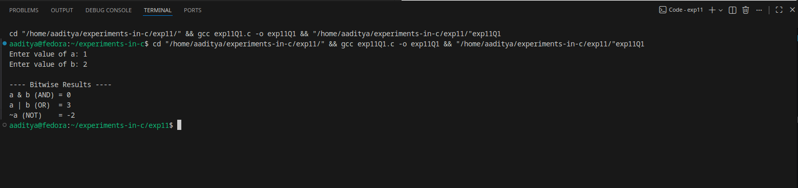
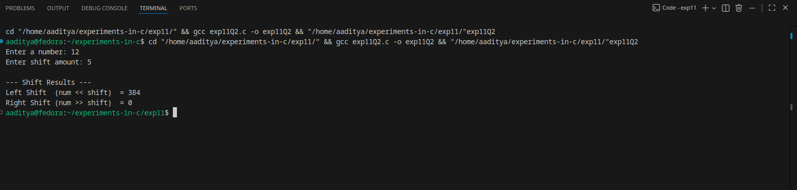

### EXPERIMENT:11 BITWISE OPERATOR
### Q1.Write a program to apply bitwise OR,AND and NOT operators on bit level.
### Algorithm:
Step 1: Start
Step 2: Declare two integers a and b
Step 3: Read input values for a and b
Step 4: Compute

* AND = a & b

* OR = a | b

* NOT = ~a (bitwise NOT of a)

Step 5: Display results
Step 6: Stop
### Code:
```

#include <stdio.h>

int main() {
    int a, b;
    int and_result, or_result, not_result;

    printf("Enter value of a: ");
    scanf("%d", &a);

    printf("Enter value of b: ");
    scanf("%d", &b);

    // Bitwise operations
    and_result = a & b;   // AND
    or_result  = a | b;   // OR
    not_result = ~a;      // NOT (only on a)

    printf("\n---- Bitwise Results ----\n");
    printf("a & b (AND) = %d\n", and_result);
    printf("a | b (OR)  = %d\n", or_result);
    printf("~a (NOT)    = %d\n", not_result);

    return 0;
}
```
### Flowchart:
                         ┌──────────────┐
                         │     Start     │
                         └───────┬──────┘
                                 │
                     ┌──────────▼─────────┐
                     │ Input a, b          │
                     └──────────┬─────────┘
                                │
                ┌──────────────▼──────────────┐
                │ AND = a & b                  │
                └──────────────┬──────────────┘
                                │
                ┌──────────────▼──────────────┐
                │ OR  = a | b                  │
                └──────────────┬──────────────┘
                                │
                ┌──────────────▼──────────────┐
                │ NOT = ~a                     │
                └──────────────┬──────────────┘
                                │
                ┌──────────────▼──────────────┐
                │ Print AND, OR, NOT results   │
                └──────────────┬──────────────┘
                                │
                           ┌────▼────┐
                           │  Stop   │
                           └─────────┘
### Output:

### Q2.write a program to apply left shift and right shift operator.
### Algorithm:
Step 1: Start
Step 2: Declare an integer variable num and shift amount shift
Step 3: Read num and shift from the user
Step 4: Compute

* left = num << shift

* right = num >> shift

Step 5: Display results
Step 6: Stop
### Code:
```
#include <stdio.h>

int main() {
    int num, shift;
    int left_result, right_result;

    printf("Enter a number: ");
    scanf("%d", &num);

    printf("Enter shift amount: ");
    scanf("%d", &shift);

    // Perform shift operations
    left_result = num << shift;   // Left shift
    right_result = num >> shift;  // Right shift

    printf("\n--- Shift Results ---\n");
    printf("Left Shift  (num << shift)  = %d\n", left_result);
    printf("Right Shift (num >> shift)  = %d\n", right_result);

    return 0;
}
```
### Flowchart:
                           ┌──────────────┐
                           │     Start     │
                           └───────┬──────┘
                                   │
                        ┌──────────▼───────────┐
                        │ Input num, shift      │
                        └──────────┬───────────┘
                                   │
                        ┌──────────▼───────────┐
                        │ left  = num << shift  │
                        └──────────┬───────────┘
                                   │
                        ┌──────────▼───────────┐
                        │ right = num >> shift  │
                        └──────────┬───────────┘
                                   │
                        ┌──────────▼────────────┐
                        │ Print left & right     │
                        └──────────┬────────────┘
                                   │
                              ┌────▼────┐
                              │  Stop    │
                              └──────────┘
### Output:
