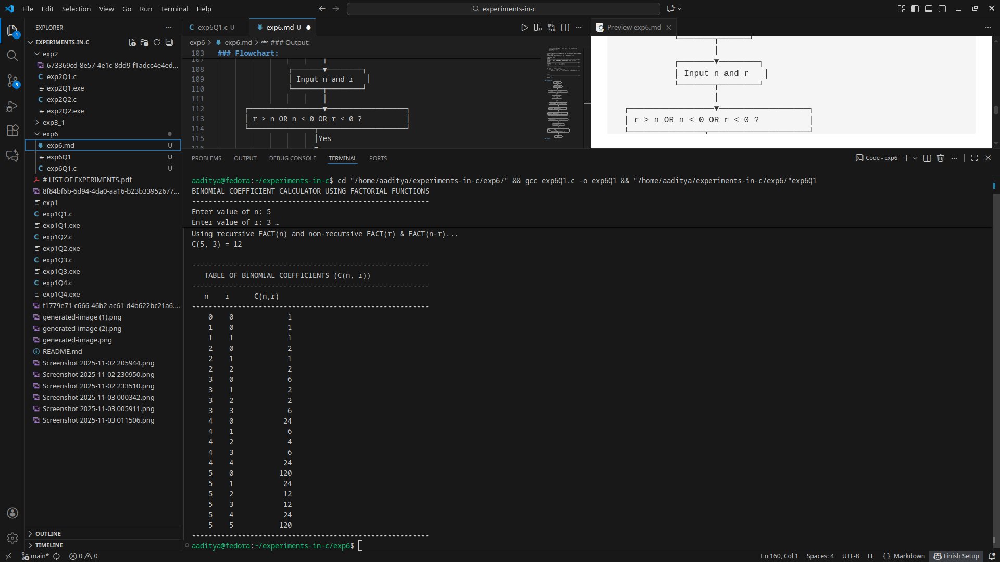
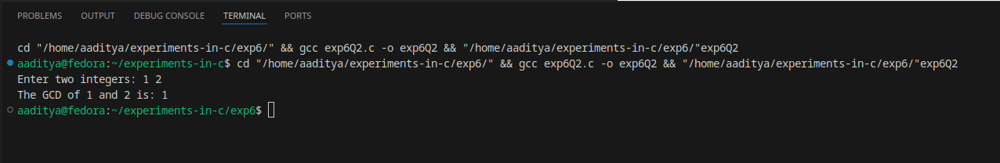
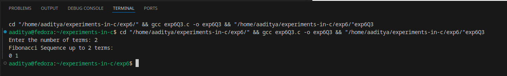
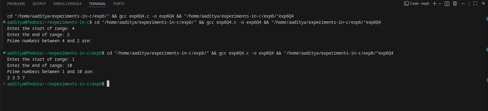
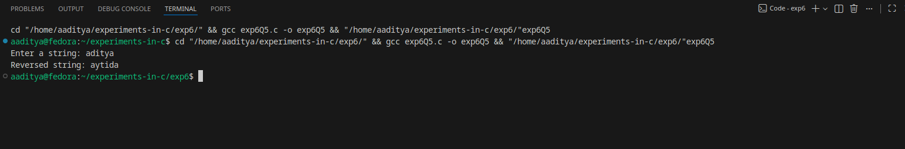

### EXPERIMENT:6  FUNCTIONS
### Q1.Develop a recursive and non recursive function FACT(num) to find the factorial of a number, n! defined by FACT(n)=1,n=0.Otherwise,FACT(n)=n*FACT(n-1).using this function write a C program to compute the binomial coffecient . Tabulate the result for different values of n and r with suitable messages.
### Algorithm:
Step 1: Start
Step 2: Read values of n and r
Step 3: If (r > n OR n < 0 OR r < 0)

  Print “Invalid Input” and Stop

Step 4: Compute factorial of n using recursive FACT(n)

 FACT_rec(n):
 If n = 0 → return 1
 Else → return n × FACT_rec(n−1)

Step 5: Compute factorial of r using non-recursive FACT(r)

 FACT_nonrec(r):
 Initialize fact = 1
 For i = 1 to r:
  fact = fact × i
 Return fact

Step 6: Compute factorial of (n − r) using non-recursive FACT(n−r)
Step 7: Compute Binomial Coefficient

 C(n, r) = FACT(n) / (FACT(r) × FACT(n − r))

Step 8: Display the value of C(n, r)
Step 9: Print table of binomial coefficients

 For i = 0 to n
  For j = 0 to i
   Compute C(i, j)
   Display result

Step 10: Stop
### code:
```
#include <stdio.h>

// Recursive factorial function
long long FACT_rec(int n) {
    if (n == 0)
        return 1;
    else
        return n * FACT_rec(n - 1);
}

// Non-recursive factorial function
long long FACT_nonrec(int n) {
    long long fact = 1;
    for (int i = 1; i <= n; i++)
        fact *= i;
    return fact;
}

// Function to compute binomial coefficient C(n, r)
long long binomial(int n, int r) {
    long long num = FACT_rec(n);          // Using recursive factorial
    long long den = FACT_nonrec(r) * FACT_nonrec(n - r); // Using non-recursive factorial
    return num / den;
}

int main() {
    int n, r;

    printf("BINOMIAL COEFFICIENT CALCULATOR USING FACTORIAL FUNCTIONS\n");
    printf("---------------------------------------------------------\n");

    printf("Enter value of n: ");
    scanf("%d", &n);

    printf("Enter value of r: ");
    scanf("%d", &r);

    if (r > n || n < 0 || r < 0) {
        printf("Invalid input! r must be <= n and both must be non-negative.\n");
        return 1;
    }

    printf("\nUsing recursive FACT(n) and non-recursive FACT(r) & FACT(n-r)...\n");
    printf("C(%d, %d) = %lld\n\n", n, r, binomial(n, r));

    // Display table
    printf("---------------------------------------------------------\n");
    printf("   TABLE OF BINOMIAL COEFFICIENTS (C(n, r))\n");
    printf("---------------------------------------------------------\n");
    printf("   n    r      C(n,r)\n");
    printf("---------------------------------------------------------\n");

    for (int i = 0; i <= n; i++) {
        for (int j = 0; j <= i; j++) {
            printf("  %3d  %3d    %10lld\n", i, j, binomial(i, j));
        }
    }

    printf("---------------------------------------------------------\n");

    return 0;
}
```
### Flowchart:
                ┌──────────────┐
                │     Start     │
                └───────┬──────┘
                        │
                ┌───────▼────────┐
                │ Input n and r   │
                └───────┬────────┘
                        │
      ┌─────────────────▼──────────────────┐
      │ r > n OR n < 0 OR r < 0 ?          │
      └───────────────┬────────────────────┘
                      │Yes
                      ▼
             ┌──────────────────┐
             │ Print "Invalid"   │
             │       Stop        │
             └──────────────────┘

                      │No
                      ▼
        ┌─────────────────────────────────┐
        │ Compute FACT_rec(n) (recursive) │
        └─────────────────┬───────────────┘
                          │
                          ▼
       ┌──────────────────────────────────┐
       │ Compute FACT_nonrec(r)          │
       └──────────────────┬──────────────┘
                          │
                          ▼
     ┌─────────────────────────────────────┐
     │ Compute FACT_nonrec(n - r)          │
     └───────────────────┬─────────────────┘
                         │
                         ▼
      ┌─────────────────────────────────────┐
      │ Compute C(n,r) = n!/(r!×(n-r)!)      │
      └───────────────────┬─────────────────┘
                          │
                          ▼
              ┌──────────────────────┐
              │ Display C(n, r)      │
              └───────────┬──────────┘
                          │
                          ▼
     ┌────────────────────────────────────────┐
     │ For i = 0 to n                          │
     │   For j = 0 to i                        │
     │      Compute and Display C(i, j)        │
     └───────────────────┬────────────────────┘
                          │
                          ▼
                  ┌──────────────┐
                  │     Stop      │
                  └──────────────┘
### Output:

### Q2.Develop a recusrsive GCD function(num1,num2)that accepts two integer arguments .write a c program that invokes this function to find greatest common divisior of two given integers.
### Algorithm:
Step 1: Start
Step 2: Read two integers num1 and num2
Step 3: Call the function GCD(num1, num2)
Inside GCD(a, b):

If b == 0, return a

Otherwise, return GCD(b, a % b)

Step 4: Display the returned GCD value
Step 5: Stop
### Code:
```
#include <stdio.h>

// Recursive function to find GCD
int GCD(int num1, int num2) {
    if (num2 == 0)
        return num1;
    else
        return GCD(num2, num1 % num2);
}

int main() {
    int a, b;

    printf("Enter two integers: ");
    scanf("%d %d", &a, &b);

    printf("The GCD of %d and %d is: %d\n", a, b, GCD(a, b));

    return 0;
}
```
### Flowchart:
                ┌──────────────┐
                │     Start     │
                └───────┬──────┘
                        │
                ┌───────▼─────────────┐
                │ Input num1, num2     │
                └────────┬────────────┘
                         │
                ┌────────▼─────────────┐
                │ Call GCD(num1, num2) │
                └────────┬────────────┘
                         │
                         ▼
                ┌──────────────────────┐
                │ Display GCD result   │
                └─────────┬────────────┘
                          │
                          ▼
                    ┌──────────┐
                    │   Stop    │
                    └──────────┘


        ┌──────────────────────────┐
        │    GCD(a, b) Function    │
        └─────────┬────────────────┘
                  │
         ┌────────▼─────────┐
         │ Is b = 0 ?        │
         └───────┬──────────┘
                 │Yes
                 ▼
        ┌────────────────────┐
        │ return a            │
        └────────────────────┘

                 │No
                 ▼
       ┌──────────────────────────────┐
       │ return GCD(b, a % b)         │
       └──────────────────────────────┘
### Output:

### Q3.Develop a recursive function FIBO(num)that accepts an integer argument.Write a C program that invokes this function to generate the Fibonacci sequence up to num.
### Algorithm:
Step 1: Start
Step 2: Read the value of num (the limit of the sequence)
Step 3: For each value i from 0 to num−1

  Call FIBO(i)
  Display the returned value

Step 4: End loop
Step 5: Stop
Recursive Function FIBO(n):

If n == 0, return 0

If n == 1, return 1

Otherwise return FIBO(n−1) + FIBO(n−2)
### Code:
```
#include <stdio.h>

// Recursive Fibonacci function
int FIBO(int num) {
    if (num == 0)
        return 0;
    if (num == 1)
        return 1;
    return FIBO(num - 1) + FIBO(num - 2);
}

int main() {
    int num;

    printf("Enter the number of terms: ");
    scanf("%d", &num);

    printf("Fibonacci Sequence up to %d terms:\n", num);

    for (int i = 0; i < num; i++) {
        printf("%d ", FIBO(i));
    }

    printf("\n");

    return 0;
}
```
### Flowchart:
                ┌──────────────┐
                │     Start     │
                └───────┬──────┘
                        │
                ┌───────▼────────┐
                │ Input num        │
                └────────┬────────┘
                         │
                ┌────────▼──────────┐
                │ i = 0             │
                └────────┬──────────┘
                         │
         ┌───────────────▼──────────────┐
         │ Is i < num ?                  │
         └───────────────┬──────────────┘
                         │No
                         ▼
                ┌──────────────────┐
                │      Stop         │
                └──────────────────┘
                         │
                        Yes
                         ▼
          ┌────────────────────────────┐
          │ Call FIBO(i)               │
          │ Print result               │
          └───────────────┬────────────┘
                          │
                ┌─────────▼─────────┐
                │ i = i + 1          │
                └────────────────────┘


        ------- FIBO(n) FUNCTION -------

          ┌──────────────────────┐
          │      FIBO(n)         │
          └──────────┬───────────┘
                     │
            ┌────────▼────────┐
            │ Is n = 0 ?       │
            └───────┬─────────┘
                    │Yes
                    ▼
          ┌────────────────────┐
          │ return 0           │
          └────────────────────┘
                    │No
                    ▼
            ┌────────▼──────────┐
            │ Is n = 1 ?         │
            └───────┬───────────┘
                    │Yes
                    ▼
          ┌────────────────────┐
          │ return 1           │
          └────────────────────┘
                    │No
                    ▼
     ┌──────────────────────────────────────┐
     │ return FIBO(n-1) + FIBO(n-2)         │
     └──────────────────────────────────────┘
### Output:

### Q4.Develop a C function ISPRIME (num)that accepts an integer argument and returns 1 if the argument is prime,a 0 otherwise .Write a C program that invokes this function to generate prime numbers between the given ranges.
### Algorithm:
Step 1: Start
Step 2: Read the lower limit start and upper limit end
Step 3: For each number i from start to end

  Call ISPRIME(i)
  If function returns 1 → Print i

Step 4: End loop
Step 5: Stop
Algorithm for ISPRIME(num):

If num ≤ 1, return 0

For i = 2 to num/2
  If num % i == 0, return 0

Return 1 (number is prime)
### Code:
```
#include <stdio.h>

// Function to check if number is prime
int ISPRIME(int num) {
    if (num <= 1)
        return 0;

    for (int i = 2; i <= num / 2; i++) {
        if (num % i == 0)
            return 0;  // Not prime
    }

    return 1;  // Prime
}

int main() {
    int start, end;

    printf("Enter the start of range: ");
    scanf("%d", &start);

    printf("Enter the end of range: ");
    scanf("%d", &end);

    printf("Prime numbers between %d and %d are:\n", start, end);

    for (int i = start; i <= end; i++) {
        if (ISPRIME(i))
            printf("%d ", i);
    }

    printf("\n");

    return 0;
}
```
### Flowchart:
                 ┌──────────────┐
                 │     Start     │
                 └───────┬──────┘
                         │
               ┌─────────▼──────────┐
               │ Input start, end    │
               └─────────┬──────────┘
                         │
                ┌────────▼──────────┐
                │   i = start       │
                └────────┬──────────┘
                         │
     ┌───────────────────▼────────────────────┐
     │ Is i <= end ?                          │
     └───────────────────┬────────────────────┘
                         │No
                         ▼
               ┌──────────────────┐
               │       Stop        │
               └──────────────────┘

                         │Yes
                         ▼
           ┌──────────────────────────────┐
           │ Call ISPRIME(i)              │
           └──────────────────────────────┘
                         │
                         ▼
           ┌──────────────────────────────┐
           │ If ISPRIME returns 1         │
           │     Print i                  │
           └──────────────────────────────┘
                         │
                ┌────────▼───────────┐
                │   i = i + 1        │
                └─────────────────────┘


       -------- FLOWCHART FOR ISPRIME(num) ---------

                ┌──────────────┐
                │  ISPRIME(n)  │
                └───────┬──────┘
                        │
                ┌───────▼──────────┐
                │ if n <= 1 return 0│
                └────────┬──────────┘
                         │
                ┌────────▼──────────┐
                │ i = 2             │
                └────────┬──────────┘
                         │
     ┌───────────────────▼──────────────────────┐
     │ Is i <= n/2 ?                             │
     └───────────────────┬──────────────────────┘
                         │No
                         ▼
              ┌─────────────────────┐
              │ return 1 (prime)    │
              └─────────────────────┘

                         │Yes
                         ▼
        ┌────────────────────────────────┐
        │ if n % i == 0 → return 0       │
        └────────────────────────────────┘
                         │
                ┌────────▼─────────┐
                │ i = i + 1        │
                └───────────────────┘
### Output:

### Q5.Develop a function REVERSE (str) that accepts a string argument.Write a C program that invokes this function to find the reverse of a given string.
### Algorithm:
Step 1: Start
Step 2: Input a string str
Step 3: Call the function REVERSE(str)
Step 4: Inside REVERSE(str):

Find the length of the string

Swap characters from start and end

Continue until the middle of the string

Step 5: Return the reversed string
Step 6: Display the reversed string in main()
Step 7: Stop
### Code:
```
#include <stdio.h>
#include <string.h>

// Function to reverse a string
void REVERSE(char str[]) {
    int i, j;
    char temp;

    j = strlen(str) - 1;  // last index

    for (i = 0; i < j; i++, j--) {
        temp = str[i];
        str[i] = str[j];
        str[j] = temp;
    }
}

int main() {
    char str[100];

    printf("Enter a string: ");
    gets(str);   // (Use fgets in modern compilers)

    REVERSE(str);  // function call

    printf("Reversed string: %s\n", str);

    return 0;
}
```
### Flowchart:
                ┌──────────────┐
                │     Start     │
                └───────┬──────┘
                        │
                ┌───────▼─────────────┐
                │   Input string str   │
                └────────┬────────────┘
                         │
                ┌────────▼───────────┐
                │ Call REVERSE(str)   │
                └────────┬───────────┘
                         │
                ┌────────▼────────────┐
                │ Print reversed str   │
                └────────┬────────────┘
                         │
                ┌────────▼──────────┐
                │       Stop        │
                └────────────────────┘


     ---------- FUNCTION: REVERSE(str) ----------

                ┌──────────────┐
                │ REVERSE(str) │
                └───────┬──────┘
                        │
                ┌───────▼──────────────────┐
                │ i = 0                    │
                │ j = length(str) - 1      │
                └────────┬─────────────────┘
                         │
        ┌────────────────▼─────────────────────┐
        │ Is i < j ?                            │
        └────────────────┬──────────────────────┘
                         │No
                         ▼
                ┌──────────────────────┐
                │ Return (string done) │
                └──────────────────────┘
                         │
                         ▼
        ┌──────────────────────────────────────┐
        │ temp = str[i]                        │
        │ str[i] = str[j]                      │
        │ str[j] = temp                        │
        └─────────────────┬────────────────────┘
                          │
                ┌─────────▼──────────┐
                │ i = i + 1           │
                │ j = j - 1           │
                └─────────────────────┘
                          │
                          └───(Repeat Loop)───▶
### Output:



