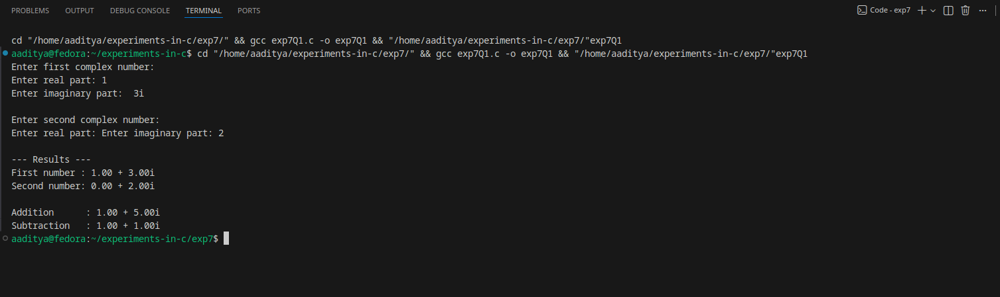
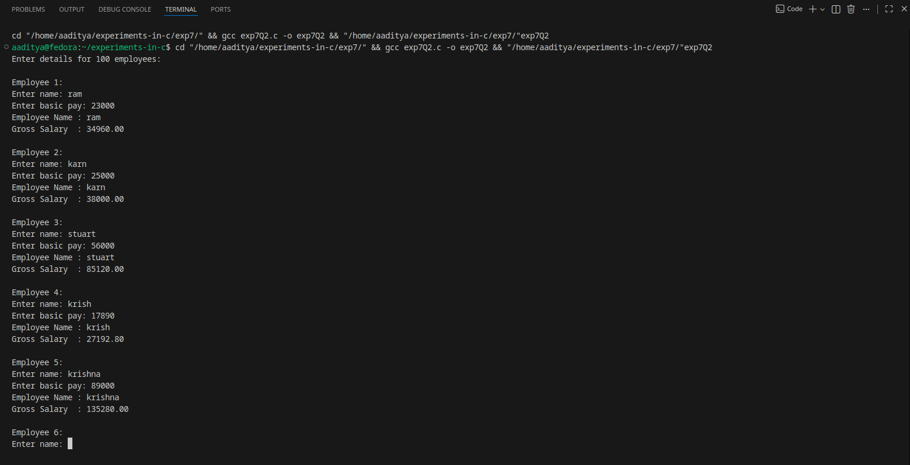
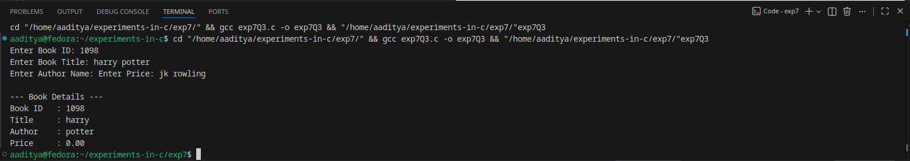
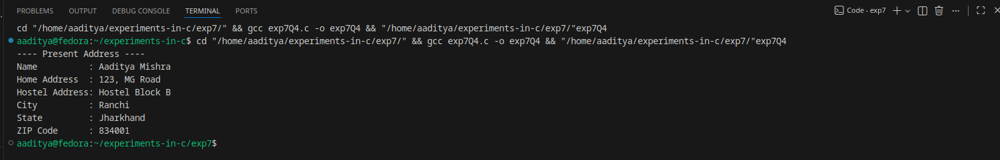

### EXPERIMENT:7 Structures and Union
### Q1.Write a C program that uses functions to perform the following operations:
### a) Reading a complex number.
### b) Writing a complex number.
### c) Addition and substraction of two complex numbers
### NOTE:represent complex number using a structure.
### Algorithm:
Step 1: Start
Step 2: Define a structure complex with fields:

* real

* imag

Step 3: Create functions:

* readComplex() → reads a complex number

* *omplex() → displays a complex number

* addComplex() → returns addition

* subComplex() → returns subtraction

Step 4: In main()

* Read two complex numbers c1 and c2

Compute:

* sum = addComplex(c1, c2)

* diff = subComplex(c1, c2)

Display both

Step 5: Stop
### Code:
```
#include <stdio.h>

// structure for complex number
struct complex {
    float real;
    float imag;
};

// function to read a complex number
struct complex readComplex() {
    struct complex c;
    printf("Enter real part: ");
    scanf("%f", &c.real);
    printf("Enter imaginary part: ");
    scanf("%f", &c.imag);
    return c;
}

// function to write a complex number
void writeComplex(struct complex c) {
    if (c.imag >= 0)
        printf("%.2f + %.2fi\n", c.real, c.imag);
    else
        printf("%.2f - %.2fi\n", c.real, -c.imag);
}

// function for addition
struct complex addComplex(struct complex c1, struct complex c2) {
    struct complex result;
    result.real = c1.real + c2.real;
    result.imag = c1.imag + c2.imag;
    return result;
}

// function for subtraction
struct complex subComplex(struct complex c1, struct complex c2) {
    struct complex result;
    result.real = c1.real - c2.real;
    result.imag = c1.imag - c2.imag;
    return result;
}

int main() {
    struct complex c1, c2, sum, diff;

    printf("Enter first complex number:\n");
    c1 = readComplex();

    printf("\nEnter second complex number:\n");
    c2 = readComplex();

    sum  = addComplex(c1, c2);
    diff = subComplex(c1, c2);

    printf("\n--- Results ---\n");
    printf("First number : ");
    writeComplex(c1);

    printf("Second number: ");
    writeComplex(c2);

    printf("\nAddition      : ");
    writeComplex(sum);

    printf("Subtraction   : ");
    writeComplex(diff);

    return 0;
}
```
### Flowchart:
                ┌──────────────┐
                │     Start     │
                └───────┬──────┘
                        │
                ┌───────▼─────────────┐
                │ Read c1 (readComplex)│
                └────────┬────────────┘
                         │
                ┌────────▼─────────────┐
                │ Read c2 (readComplex)│
                └────────┬────────────┘
                         │
                ┌────────▼─────────────┐
                │ sum = addComplex      │
                └────────┬────────────┘
                         │
                ┌────────▼─────────────┐
                │ diff = subComplex     │
                └────────┬────────────┘
                         │
                ┌────────▼──────────────┐
                │ Write results          │
                └────────┬──────────────┘
                         │
                ┌────────▼──────────┐
                │       Stop         │
                └────────────────────┘
### Output:

### Q2.Write Aa C program to compute monthly pay of 100 employees using each employees name,basic pay.The DA is computed as 52% of the basic pay.Gross Salary(basic pay+DA).Print the employees name and gross salary.
### Algorithm:
Step 1: Start
Step 2: Declare variables:

name (string)

basic pay (float)

DA (float)

gross salary (float)

Step 3: Loop from 1 to 100 employees

  3.1 Read employee name
  3.2 Read basic pay
  3.3 Compute DA = 0.52 × basic pay
  3.4 Compute gross salary = basic pay + DA
  3.5 Print employee name and gross salary

Step 4: End loop
Step 5: Stop
### Code:
```
#include <stdio.h>

int main() {
    char name[50];
    float basic, da, gross;

    printf("Enter details for 100 employees:\n\n");

    for (int i = 1; i <= 100; i++) {
        printf("Employee %d:\n", i);

        printf("Enter name: ");
        scanf("%s", name);      // reads name without spaces

        printf("Enter basic pay: ");
        scanf("%f", &basic);

        da = 0.52 * basic;          // DA = 52% of basic
        gross = basic + da;         // Gross = basic + DA

        printf("Employee Name : %s\n", name);
        printf("Gross Salary  : %.2f\n\n", gross);
    }

    return 0;
}
```
### Flowchart:
                         ┌──────────────┐
                         │     Start     │
                         └───────┬──────┘
                                 │
                         ┌───────▼────────┐
                         │ i = 1           │
                         └────────┬────────┘
                                  │
               ┌──────────────────▼────────────────────┐
               │ Is i ≤ 100 ?                          │
               └───────────────┬────────────────────────┘
                               │No
                               ▼
                        ┌──────────────┐
                        │     Stop      │
                        └──────────────┘

                               │Yes
                               ▼
                ┌────────────────────────────┐
                │ Read employee name          │
                └──────────────┬─────────────┘
                               │
                ┌──────────────▼─────────────┐
                │ Read basic pay              │
                └──────────────┬─────────────┘
                               │
                ┌──────────────▼─────────────┐
                │ DA = 0.52 × basic           │
                └──────────────┬─────────────┘
                               │
                ┌──────────────▼─────────────┐
                │ Gross = basic + DA          │
                └──────────────┬─────────────┘
                               │
                ┌──────────────▼─────────────┐
                │ Print name and gross salary │
                └──────────────┬─────────────┘
                               │
                       ┌───────▼───────┐
                       │  i = i + 1     │
                       └───────────────┘
### Output:

### Q3.Create a book structure contanining book_id,title,author name and price.Write a C program to pass structure as a function argument and print the details.
### Algorithm:
Step 1: Start
Step 2: Define a structure Book with fields:

* book_id (int)

* title (string)

* author (string)

* price (float)

Step 3: Create a function displayBook(Book b) to print the details.
Step 4: In main()

* Declare a variable of type Book

* Input book details (id, title, author, price)

* Call displayBook(b) by passing structure as argument

End program

Step 5: Stop
### Code:
```
#include <stdio.h>

// structure definition
struct Book {
    int book_id;
    char title[50];
    char author[50];
    float price;
};

// function to display book details (structure as argument)
void displayBook(struct Book b) {
    printf("\n--- Book Details ---\n");
    printf("Book ID   : %d\n", b.book_id);
    printf("Title     : %s\n", b.title);
    printf("Author    : %s\n", b.author);
    printf("Price     : %.2f\n", b.price);
}

int main() {
    struct Book b;

    printf("Enter Book ID: ");
    scanf("%d", &b.book_id);

    printf("Enter Book Title: ");
    scanf("%s", b.title);

    printf("Enter Author Name: ");
    scanf("%s", b.author);

    printf("Enter Price: ");
    scanf("%f", &b.price);

    // pass structure to function
    displayBook(b);

    return 0;
}
```
### Flowchart:
                     ┌──────────────┐
                     │     Start     │
                     └───────┬──────┘
                             │
                 ┌───────────▼───────────┐
                 │ Input book_id          │
                 └───────────┬───────────┘
                             │
                 ┌───────────▼───────────┐
                 │ Input title            │
                 └───────────┬───────────┘
                             │
                 ┌───────────▼───────────┐
                 │ Input author           │
                 └───────────┬───────────┘
                             │
                 ┌───────────▼───────────┐
                 │ Input price            │
                 └───────────┬───────────┘
                             │
                 ┌───────────▼────────────┐
                 │ Call displayBook(b)     │
                 └───────────┬────────────┘
                             │
                     ┌───────▼───────┐
                     │     Stop       │
                     └───────────────┘
### Output:

### Q4.Create a Union containing 6 strings : name,home_address,hostel_address,city ,state and zip.Write a C program to display your present address.
### Algorithm:
Step 1: Start
Step 2: Define a union Address with members:

name

home_address

hostel_address

city

state

zip

Step 3: Declare a variable of union type (A).
Step 4: Copy a string into A.name using strcpy()

  Print the value

Step 5: Copy a string into A.home_address

  Print the value

Step 6: Copy a string into A.hostel_address

  Print

Step 7: Copy a string into A.city

  Print

Step 8: Copy a string into A.state

  Print

Step 9: Copy a string into A.zip

  Print

Step 10: Stop
### Code:
```
#include <stdio.h>
#include <string.h>

union Address {
    char name[50];
    char home_address[100];
    char hostel_address[100];
    char city[50];
    char state[50];
    char zip[10];
};

int main() {
    union Address A;

    printf("---- Present Address ----\n");

    strcpy(A.name, "Aaditya Mishra");
    printf("Name          : %s\n", A.name);

    strcpy(A.home_address, "123, MG Road");
    printf("Home Address  : %s\n", A.home_address);

    strcpy(A.hostel_address, "Hostel Block B");
    printf("Hostel Address: %s\n", A.hostel_address);

    strcpy(A.city, "Ranchi");
    printf("City          : %s\n", A.city);

    strcpy(A.state, "Jharkhand");
    printf("State         : %s\n", A.state);

    strcpy(A.zip, "834001");
    printf("ZIP Code      : %s\n", A.zip);

    return 0;
}
```
### Flowchart:
                     ┌──────────────┐
                     │     Start     │
                     └───────┬──────┘
                             │
             ┌───────────────▼──────────────────┐
             │ Define union Address with fields  │
             │ name, home_address, etc.          │
             └───────────────┬──────────────────┘
                             │
                 ┌───────────▼────────────┐
                 │ Declare A (union var)   │
                 └───────────┬────────────┘
                             │
                 ┌───────────▼────────────┐
                 │ Copy string to A.name   │
                 │ Print A.name            │
                 └───────────┬────────────┘
                             │
                 ┌───────────▼────────────┐
                 │ Copy to A.home_address  │
                 │ Print home_address      │
                 └───────────┬────────────┘
                             │
                 ┌───────────▼────────────┐
                 │ Copy to A.hostel_addr   │
                 │ Print hostel_address    │
                 └───────────┬────────────┘
                             │
                 ┌───────────▼────────────┐
                 │ Copy to A.city          │
                 │ Print city              │
                 └───────────┬────────────┘
                             │
                 ┌───────────▼────────────┐
                 │ Copy to A.state         │
                 │ Print state             │
                 └───────────┬────────────┘
                             │
                 ┌───────────▼────────────┐
                 │ Copy to A.zip           │
                 │ Print ZIP code          │
                 └───────────┬────────────┘
                             │
                      ┌──────▼──────┐
                      │    Stop      │
                      └──────────────┘
### Output:

