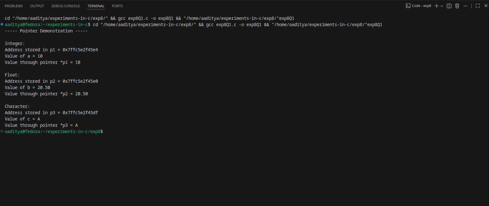
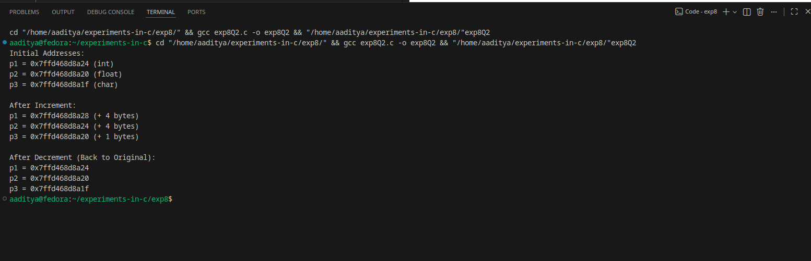
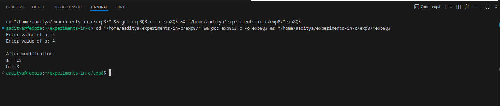

### EXPERIMENT:8 POINTERS
### Q1.Declare different type of pointers(int,float,char)and initialize them with the addresses of variables.Print the values of both the pointers and the variable they point to.
### Algorithm:
Step 1: Start
Step 2: Declare variables:

* an integer variable a

* a float variable b

* a char variable c

Step 3: Declare pointers:

* int *p1

* float *p2

* char *p3

Step 4: Initialize pointers with addresses:

* p1 = &a

* p2 = &b

* p3 = &c

Step 5: Print pointer addresses
Step 6: Print the values using:

* the variables themselves

* dereferencing the pointers (*p1, *p2, *p3)

Step 7: Stop
### code:
```
#include <stdio.h>

int main() {
    int a = 10;
    float b = 20.5;
    char c = 'A';

    int *p1 = &a;
    float *p2 = &b;
    char *p3 = &c;

    printf("----- Pointer Demonstration -----\n");

    printf("\nInteger:\n");
    printf("Address stored in p1 = %p\n", p1);
    printf("Value of a = %d\n", a);
    printf("Value through pointer *p1 = %d\n", *p1);

    printf("\nFloat:\n");
    printf("Address stored in p2 = %p\n", p2);
    printf("Value of b = %.2f\n", b);
    printf("Value through pointer *p2 = %.2f\n", *p2);

    printf("\nCharacter:\n");
    printf("Address stored in p3 = %p\n", p3);
    printf("Value of c = %c\n", c);
    printf("Value through pointer *p3 = %c\n", *p3);

    return 0;
}
```
### Flowchart:
                         ┌──────────────┐
                         │     Start     │
                         └───────┬──────┘
                                 │
                  ┌──────────────▼──────────────┐
                  │ Declare a, b, c (variables)  │
                  └──────────────┬──────────────┘
                                 │
                  ┌──────────────▼──────────────┐
                  │ Declare p1, p2, p3 (pointers)│
                  └──────────────┬──────────────┘
                                 │
                  ┌──────────────▼──────────────┐
                  │ p1=&a, p2=&b, p3=&c          │
                  └──────────────┬──────────────┘
                                 │
                  ┌──────────────▼──────────────┐
                  │ Print pointer addresses      │
                  └──────────────┬──────────────┘
                                 │
                  ┌──────────────▼──────────────┐
                  │ Print values of a, b, c      │
                  └──────────────┬──────────────┘
                                 │
                  ┌──────────────▼──────────────┐
                  │ Print *p1, *p2, *p3          │
                  └──────────────┬──────────────┘
                                 │
                           ┌─────▼────┐
                           │   Stop    │
                           └───────────┘
### Output:

### Q2.Perform pointer arithmetic (increament and decreament)on pointers of different data types.observe how the memory addresses changes and effects on data access.
### Algorithm:
Step 1: Start
Step 2: Declare variables:

* int a = 10

* float b = 5.5

* char c = 'X'

 Step 3: Declare pointers:

* int *p1 = &a

* float *p2 = &b

* char *p3 = &c

Step 4: Print initial pointer values (addresses)
Step 5: Perform pointer increment:

* p1++

* p2++
 
* p3++
* Print new addresses.

Step 6: Perform pointer decrement:

* p1--

* p2--
 
* p3--
Print new addresses.

Step 7: End Program
### Code:
```
#include <stdio.h>

int main() {
    int a = 10;
    float b = 5.5;
    char c = 'X';

    int *p1 = &a;
    float *p2 = &b;
    char *p3 = &c;

    printf("Initial Addresses:\n");
    printf("p1 = %p (int)\n", p1);
    printf("p2 = %p (float)\n", p2);
    printf("p3 = %p (char)\n", p3);

    // Increment
    p1++;
    p2++;
    p3++;

    printf("\nAfter Increment:\n");
    printf("p1 = %p (+ %lu bytes)\n", p1, sizeof(int));
    printf("p2 = %p (+ %lu bytes)\n", p2, sizeof(float));
    printf("p3 = %p (+ %lu bytes)\n", p3, sizeof(char));

    // Decrement
    p1--;
    p2--;
    p3--;

    printf("\nAfter Decrement (Back to Original):\n");
    printf("p1 = %p\n", p1);
    printf("p2 = %p\n", p2);
    printf("p3 = %p\n", p3);

    return 0;
}
```
### Flowchart:
                           ┌──────────────┐
                           │     Start     │
                           └───────┬──────┘
                                   │
                   ┌───────────────▼─────────────┐
                   │ Declare a, b, c              │
                   │ Declare p1, p2, p3           │
                   └───────────────┬─────────────┘
                                   │
                   ┌───────────────▼─────────────┐
                   │ Initialize pointers with     │
                   │ addresses of a, b, c         │
                   └───────────────┬─────────────┘
                                   │
                   ┌───────────────▼──────────────┐
                   │ Print initial addresses       │
                   └───────────────┬──────────────┘
                                   │
                   ┌───────────────▼──────────────┐
                   │ Increment pointers (p++)      │
                   │ Print new addresses           │
                   └───────────────┬──────────────┘
                                   │
                   ┌───────────────▼──────────────┐
                   │ Decrement pointers (p--)      │
                   │ Print addresses               │
                   └───────────────┬──────────────┘
                                   │
                             ┌─────▼──────┐
                             │    Stop     │
                             └─────────────┘
### Output:

### Q3.Write a function that accepts pointers as parameters.pass variables by refrencesusing pointers and modify their values within function.
### Algorithm:
Step 1: Start
Step 2: Declare two integer variables a and b.
Step 3: Read values of a and b from the user.
Step 4: Call a function modify(&a, &b) and pass the addresses of variables.
Inside modify(x, y):

Add 10 to the value pointed by x

Multiply the value pointed by y by 2

Step 5: Return to main()
Step 6: Print modified values of a and b.
Step 7: Stop
### Code:
```
#include <stdio.h>

// function that modifies values using pointers
void modify(int *x, int *y) {
    *x = *x + 10;   // add 10 to value of x
    *y = *y * 2;    // multiply y by 2
}

int main() {
    int a, b;

    printf("Enter value of a: ");
    scanf("%d", &a);

    printf("Enter value of b: ");
    scanf("%d", &b);

    // calling function with addresses
    modify(&a, &b);

    printf("\nAfter modification:\n");
    printf("a = %d\n", a);
    printf("b = %d\n", b);

    return 0;
}
```
### Flowchart:
                     ┌──────────────┐
                     │     Start     │
                     └───────┬──────┘
                             │
                ┌────────────▼────────────┐
                │ Read a, b from user      │
                └────────────┬────────────┘
                             │
                ┌────────────▼────────────┐
                │ Call modify(&a, &b)      │
                └────────────┬────────────┘
                             │
                ┌────────────▼────────────┐
                │ Print modified a and b   │
                └────────────┬────────────┘
                             │
                       ┌─────▼────┐
                       │   Stop    │
                       └───────────┘
### Output:
