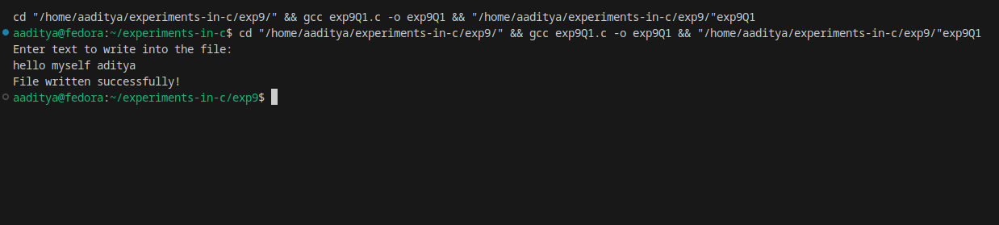
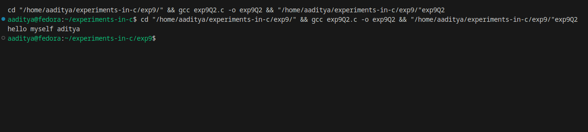

### EXPERIMENT:9 FILE HANDLING IN C
### Q1. Write a program to create a new file and write text into it.
### Algorithm:
1* Start

2* Declare a file pointer FILE *fp.

3* Open a file in write mode using:
 fp = fopen("output.txt", "w");

4* If file opening fails (fp == NULL), show an error message and exit.

5* Ask the user to enter text.

6* Read the text from the user.

7* Write the text into the file using fprintf() or fputs().

8* Close the file using fclose(fp).

9*bDisplay a message that the file has been written successfully.

10* Stop
### Code:
```
#include <stdio.h>

int main() {
    FILE *fp;
    char text[200];

    // Open file in write mode
    fp = fopen("output.txt", "w");

    // Check if file opened successfully
    if (fp == NULL) {
        printf("Error! Could not create file.\n");
        return 1;
    }

    // Get text from user
    printf("Enter text to write into the file:\n");
    fgets(text, sizeof(text), stdin);

    // Write text into file
    fprintf(fp, "%s", text);

    // Close file
    fclose(fp);

    printf("File written successfully!\n");

    return 0;
}
```
### Flowchart:
```
          ┌──────────────┐
          │     Start     │
          └──────┬───────┘
                 │
                 ▼
        ┌──────────────────┐
        │ Declare FILE *fp  │
        └──────┬───────────┘
               │
               ▼
 ┌──────────────────────────────┐
 │ fp = fopen("output.txt","w") │
 └───────────┬──────────────────┘
             │
     ┌───────▼────────┐
     │ fp == NULL ?    │
     └───────┬────────┘
             │Yes
             ▼
    ┌────────────────────┐
    │ Print error & Stop │
    └────────────────────┘
             │No
             ▼
  ┌──────────────────────────┐
  │ Ask user to enter text   │
  └───────────┬──────────────┘
              │
              ▼
  ┌──────────────────────────┐
  │ Write text to the file   │
  └───────────┬──────────────┘
              │
              ▼
  ┌──────────────────────────┐
  │ Close file using fclose  │
  └───────────┬──────────────┘
              │
              ▼
    ┌──────────────────────┐
    │ Print success message│
    └───────────┬──────────┘
                │
                ▼
          ┌──────────────┐
          │     Stop      │
          └──────────────┘
```
### Output:

### Q2.Open an existing file and read its content character by character and then close the file.
### Flowchart:
1-Start

2-Declare a file pointer FILE *fp.

3-Open the file in read mode using:
fp = fopen("input.txt", "r");

4-If the file fails to open (fp == NULL), display an error message and stop.

5-Declare a character variable ch.

6-Read a character from the file using:
ch = fgetc(fp)

7-While ch != EOF

8-Display the character on the screen

9-Read the next character

10-After reading all characters, close the file using fclose(fp).

11-Stop
### Code:
```

#include <stdio.h>

int main() {
    FILE *fp;
    char ch;

    // Open the file in read mode
    fp = fopen("input.txt", "r");

    // Check if file opened successfully
    if (fp == NULL) {
        printf("Error! Could not open file.\n");
        return 1;
    }

    // Read and display characters until EOF
    while ((ch = fgetc(fp)) != EOF) {
        putchar(ch);
    }

    // Close the file
    fclose(fp);

    return 0;
}
```
### Flowchart:
```
          ┌──────────────┐
          │     Start     │
          └──────┬───────┘
                 │
                 ▼
        ┌─────────────────────┐
        │ Declare FILE *fp    │
        └──────┬──────────────┘
               │
               ▼
 ┌─────────────────────────────┐
 │ fp = fopen("input.txt","r") │
 └───────────┬─────────────────┘
             │
     ┌───────▼────────┐
     │ fp == NULL ?    │
     └───────┬────────┘
             │Yes
             ▼
    ┌────────────────────┐
    │ Print error & Stop │
    └────────────────────┘
             │No
             ▼
     ┌──────────────────┐
     │ Read ch = fgetc  │
     └──────────┬───────┘
                │
        ┌───────▼───────────┐
        │ ch == EOF ?        │
        └───────┬────────────┘
                │Yes
                ▼
       ┌────────────────────┐
       │ Close file fclose  │
       └───────────┬────────┘
                   │
                   ▼
             ┌──────────────┐
             │     Stop      │
             └──────────────┘

                │No
                ▼
      ┌─────────────────────┐
      │ Print character ch  │
      └──────────┬──────────┘
                 │
                 └──► Go back to
                      Read next ch
```
### Output:

### Q3.Open a file read its content line by line and display each line on the console:
### Algorithm:
1-Start

2-Declare a file pointer FILE *fp.

3-Declare a string buffer (e.g., char line[200]).

4-Open the file in read mode using:
fp = fopen("input.txt", "r");

5-If fp == NULL, print an error message and stop.

6-Read a line using:
fgets(line, sizeof(line), fp)

7-While the line is not NULL:

8-Display the line on the console using printf("%s", line);

9-Read the next line using fgets()

10-Close the file using fclose(fp).

11-Stop
### Code:
```

#include <stdio.h>

int main() {
    FILE *fp;
    char line[200];

    // Open file in read mode
    fp = fopen("input.txt", "r");

    if (fp == NULL) {
        printf("Error! Could not open file.\n");
        return 1;
    }

    // Read and display each line
    while (fgets(line, sizeof(line), fp) != NULL) {
        printf("%s", line);
    }

    // Close the file
    fclose(fp);

    return 0;
}
```
### Flowchart:
```
               ┌──────────────┐
               │     Start     │
               └───────┬──────┘
                       │
                       ▼
         ┌────────────────────────┐
         │ Declare FILE *fp, line │
         └───────────┬────────────┘
                     │
                     ▼
    ┌──────────────────────────────────┐
    │ fp = fopen("input.txt", "r")     │
    └───────────────┬──────────────────┘
                    │
            ┌───────▼────────┐
            │ fp == NULL ?    │
            └───────┬────────┘
                    │Yes
                    ▼
       ┌─────────────────────────┐
       │ Print error & Stop      │
       └─────────────────────────┘
                    │No
                    ▼
     ┌──────────────────────────────────┐
     │ Read line = fgets(line, size,fp) │
     └───────────┬──────────────────────┘
                 │
       ┌─────────▼──────────┐
       │ line == NULL ?      │
       └─────────┬──────────┘
                 │Yes
                 ▼
       ┌────────────────────────┐
       │ Close file (fclose)    │
       └───────────┬────────────┘
                   │
                   ▼
              ┌──────────────┐
              │     Stop      │
              └──────────────┘

                 │No
                 ▼
      ┌─────────────────────────────┐
      │ Print the line (printf)     │
      └───────────┬─────────────────┘
                  │
                  └──► Go back to read next line
```
### Output:

*********************************************************
